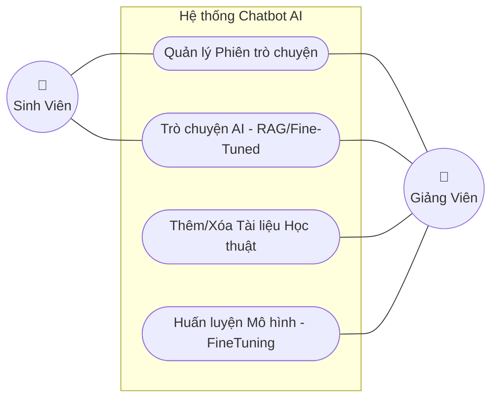
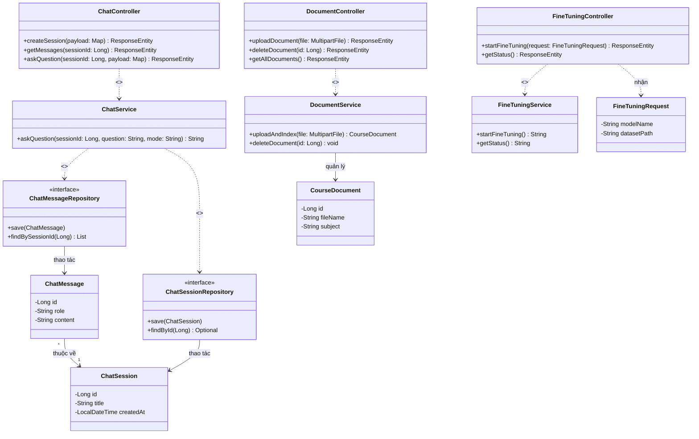
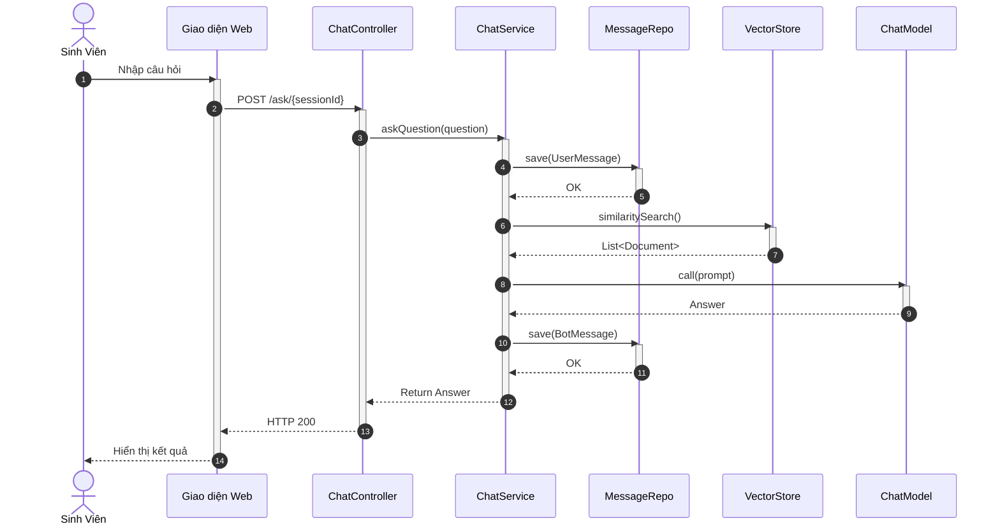
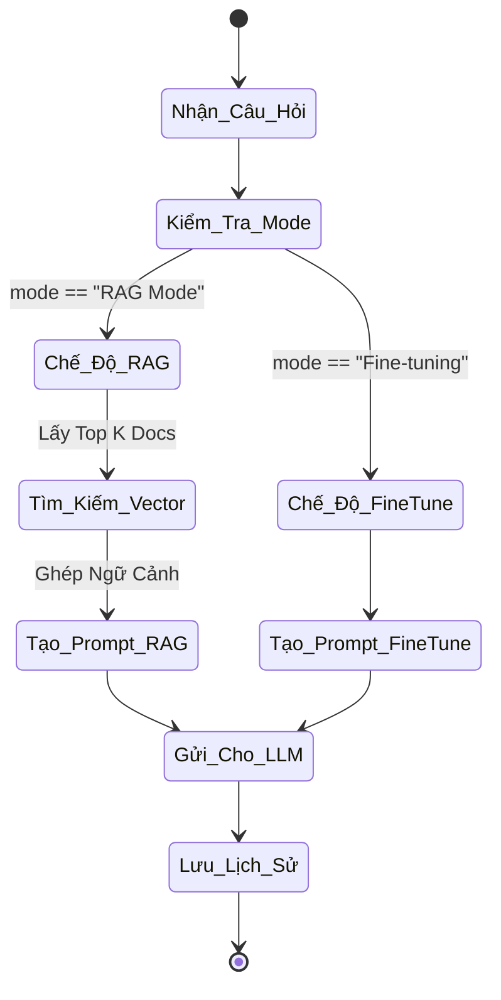

# Phân tích và Thiết kế Hệ thống Chatbot AI (Chuẩn Học thuật UML)

Tài liệu này được cập nhật để tuân thủ chặt chẽ các chuẩn **UML 2.0 (Unified Modeling Language)**, phản ánh chính xác 100% cấu trúc mã nguồn mới nhất (đã gỡ bỏ tính năng Đánh giá - Evaluation, cập nhật module Fine-Tuning và bổ sung tính năng Xóa tài liệu). Dưới mỗi biểu đồ, các nguyên lý hoạt động của hệ thống được giải thích chi tiết để phục vụ cho báo cáo học thuật.

---

## 1. Biểu đồ Use Case (Use Case Diagram)



### 💡 Nguyên lý hoạt động (Use Case Principles)
- **Tác nhân (Actors):** Hệ thống có hai đối tượng tương tác chính là **Sinh viên** (End-user cấp thấp) và **Giảng viên** (Admin cấp cao).
- **Phân quyền tương tác:** 
  - **Sinh viên** chỉ được cấp quyền truy cập vào các tác vụ cơ bản: *Quản lý phiên trò chuyện* (Tạo mới, xem lịch sử) và *Trò chuyện với AI* (để nhận câu trả lời cho các câu hỏi học thuật).
  - **Giảng viên** được kế thừa toàn bộ quyền của Sinh viên, đồng thời được cấp thêm các quyền đặc quyền quản trị dữ liệu: *Thêm/Xóa Tài liệu Học thuật* (nạp kiến thức mới cho RAG) và *Huấn luyện mô hình - FineTuning* (tinh chỉnh mô hình AI cho bài toán cụ thể).
- Nguyên tắc này đảm bảo **Tính Toàn vẹn dữ liệu (Data Integrity)** và **Tính Bảo mật (Security)**, ngăn chặn việc người dùng thông thường vô tình can thiệp vào cơ sở tri thức hoặc bộ trọng số của hệ thống AI.

---

## 2. Biểu đồ Lớp (Class Diagram)



### 💡 Nguyên lý thiết kế mã nguồn (Class Architecture Principles)
- **Kiến trúc phân lớp N-Tier (N-Tier Architecture):** Mã nguồn tuân thủ nghiêm ngặt mô hình 3 lớp (Controller -> Service -> Repository).
  - **Controller Layer (`ChatController`, `DocumentController`):** Chỉ đóng vai trò như một API Gateway, tiếp nhận HTTP Request, bóc tách Payload và trả về HTTP Response. Tuyệt đối không chứa logic nghiệp vụ (Business Logic).
  - **Service Layer (`ChatService`, `DocumentService`):** Đây là lõi trung tâm của hệ thống (Core Logic). Chứa thuật toán, logic xử lý RAG, logic Fine-tuning và thao tác tính toán nghiệp vụ.
  - **Repository Layer (Spring Data JPA):** Đảm nhiệm việc giao tiếp với Database (ORM - Object Relational Mapping).
- **Tính đóng gói (Encapsulation) & DI (Dependency Injection):** Các thuộc tính của Entity (`id`, `title`, `content`) đều được định nghĩa là `private` (-) để ẩn giấu dữ liệu. Các Service được tiêm (Inject) vào Controller thông qua cơ chế IoC (Inversion of Control) của Spring Boot, giúp giảm bớt sự phụ thuộc cứng (Loose Coupling).

---

## 3. Biểu đồ Tuần tự (Sequence Diagram)



### 💡 Nguyên lý Luồng dữ liệu RAG (RAG Data Flow Principles)
Biểu đồ tuần tự mô tả cơ chế hoạt động thời gian thực (Real-time Execution) của hệ thống RAG:
- Khi người dùng gửi câu hỏi, hệ thống lập tức lưu lại câu hỏi này xuống DB để duy trì ngữ cảnh phiên chat (`sessionId`).
- **Nguyên lý Truy xuất (Retrieval):** Thay vì gửi ngay câu hỏi cho AI, `ChatService` sử dụng VectorStore để tính toán **Độ tương đồng Cosine (Cosine Similarity)** giữa Vector Của Câu Hỏi và các Vector Tài Liệu nằm trong Database. Quá trình này truy xuất ra danh sách Top-K ngữ cảnh (`List<Document>`) khớp nhất.
- **Nguyên lý Sinh văn bản (Augmented Generation):** `ChatService` lắp ráp các Ngữ cảnh vừa tìm được cùng với Câu hỏi gốc vào một mẫu Prompt tĩnh (Prompt Template). Prompt này sau đó được đẩy tới LLM (`ChatModel`). AI lúc này đóng vai trò "đọc hiểu văn bản được cung cấp" và tổng hợp lại câu trả lời thay vì cố bịa ra từ kiến thức nội tại (giảm thiểu triệt để hiện tượng Hallucination).

---

## 4. Biểu đồ Hoạt động (Activity Diagram)



### 💡 Nguyên lý Cấu trúc Rẽ nhánh (Control Flow Principles)
- Biểu đồ mô tả cấu trúc rẽ nhánh Logic cốt lõi xử lý yêu cầu (Decision Control Flow).
- Hệ thống thiết kế một nút chuyển đổi trạng thái (`Kiểm_Tra_Mode`) dựa trên tham số truyền vào từ Front-end:
  - Nếu chế độ là **Fine-tuning**, hệ thống rẽ nhánh sang luồng sử dụng kiến thức nội tại của mô hình (đã được huấn luyện trước đó). Luồng này bỏ qua hoàn toàn các thao tác I/O với Vector DB, giúp tối ưu hóa độ trễ (Latency).
  - Nếu chế độ là **RAG**, hệ thống bắt buộc đi qua chuỗi hành động tuần tự: *Quét Vector -> Trích xuất Document -> Ghép Prompt*.
- Cấu trúc rẽ nhánh độc lập này tuân thủ nguyên lý thiết kế Open-Closed (OCP trong SOLID), giúp dễ dàng nâng cấp hoặc gỡ bỏ một luồng AI trong tương lai mà không làm sập luồng còn lại.

---

## 5. Biểu đồ Thành phần (Component Diagram)

```mermaid
flowchart TD
    %% Định nghĩa các khối Components
    UI[<<"Component">>\nFrontend Web UI]
    API[<<"Component">>\nREST API Controllers]
    Svc[<<"Component">>\nBusiness Services]
    Repo[<<"Component">>\nData Repositories]
    DB[(<<"Component">>\nPostgreSQL + Vector)]
    LLM[<<"Component">>\nOpenAI API / Local LLM]

    %% Mối liên hệ tịnh tiến từ trên xuống
    UI -. "<< HTTP/JSON >>" .-> API
    API --> Svc
    Svc --> Repo
    Svc -. "<< REST/gRPC >>" .-> LLM
    Repo --> DB
```

### 💡 Nguyên lý Kiến trúc Vi mô/Vĩ mô (Macro Architecture Principles)
- Hệ thống áp dụng **Kiến trúc Client-Server (Client-Server Architecture)** thông qua kết nối phi trạng thái HTTP/JSON.
- **Nguyên lý Tách biệt Hệ thống Lõi và Nền tảng (Separation of Concerns):**
  - Component `Vector Database` (PGVector) và Component `AI Model` (OpenAI / Local LLM) được coi là các dịch vụ ngoài (External Boundaries).
  - Việc hệ thống giao tiếp với LLM hay DB đều thực hiện qua các Interface kết nối. Điều này giúp hệ thống đạt chuẩn "Plug and Play" (Cắm và Chạy). Nếu tương lai muốn thay đổi từ OpenAI sang Gemini, hoặc thay PostgreSQL bằng Milvus, cấu trúc lõi `Business Services` không cần phải đập đi xây lại.
