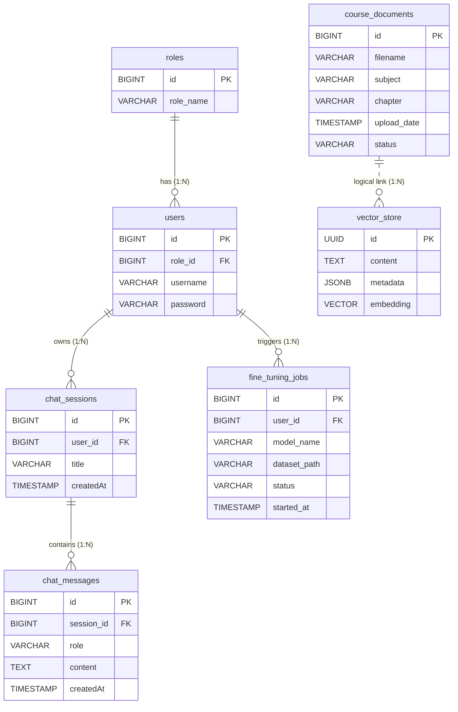

# Cấu trúc Cơ sở dữ liệu Hệ thống

Cơ sở dữ liệu của hệ thống Chatbot AI được thiết kế tuân thủ chuẩn mô hình quan hệ (RDBMS), tập trung giải quyết 3 bài toán lõi: **Quản lý Định danh (Identity), Quản lý Hội thoại (Chat History) và Xử lý Tri thức AI (RAG & Fine-Tuning)**.

## 1. Sơ đồ Thực thể Liên kết (ERD)

Sơ đồ ERD dưới đây mô tả 7 thực thể chính và các mối quan hệ logic trong hệ thống:

## 2. Mô tả chi tiết các phân hệ

### 2.1. Phân hệ Quản lý Người dùng & Phân quyền (User Management)
- **Thực thể `roles` (Quyền hạn):** Quản lý các nhóm quyền truy cập trong hệ thống (Ví dụ: `STUDENT`, `LECTURER`).
- **Thực thể `users` (Người dùng):** Lưu trữ thông tin tài khoản đăng nhập (`username`, `password`). Một nhóm quyền (`role_id`) có thể cấp cho nhiều người dùng.

### 2.2. Phân hệ Quản lý Hội thoại Chatbot (Chat Interaction)
- **Thực thể `chat_sessions` (Phiên trò chuyện):** Hoạt động như một thư mục gốc để gộp nhóm các đoạn hội thoại theo từng chủ đề riêng biệt. Có khóa ngoại `user_id` để đảm bảo tính riêng tư, sinh viên nào chỉ xem được lịch sử chat của sinh viên đó.
- **Thực thể `chat_messages` (Tin nhắn chi tiết):** Lưu trữ nội dung chi tiết của từng bong bóng chat gửi đi (`role` là `USER`) và nhận về (`role` là `BOT`). Mỗi tin nhắn thuộc về một `session_id` cụ thể.

### 2.3. Phân hệ Xử lý Tri thức AI (RAG & Fine-Tuning)
- **Thực thể `course_documents` (Tài liệu môn học):** Lưu trữ siêu dữ liệu của các file tài liệu PDF/Word mà Giảng viên tải lên để làm nguồn tri thức cho AI (`filename`, `subject`, `status`...).
- **Thực thể `vector_store` (Kho lưu trữ Vector):** Bảng cốt lõi của công nghệ RAG do PGVector quản lý. Các tài liệu sẽ được AI băm nhỏ thành nhiều đoạn (`content`) và lưu dưới dạng các mảng số học (`embedding` Vector 768 chiều). Liên kết với tài liệu gốc thông qua trường `metadata`.
- **Thực thể `fine_tuning_jobs` (Lịch sử Huấn luyện):** Quản lý tiến trình tinh chỉnh mô hình AI (Fine-Tuning) do Giảng viên kích hoạt, theo dõi qua các trạng thái `PENDING`, `RUNNING`, `SUCCESS`, `FAILED`.
