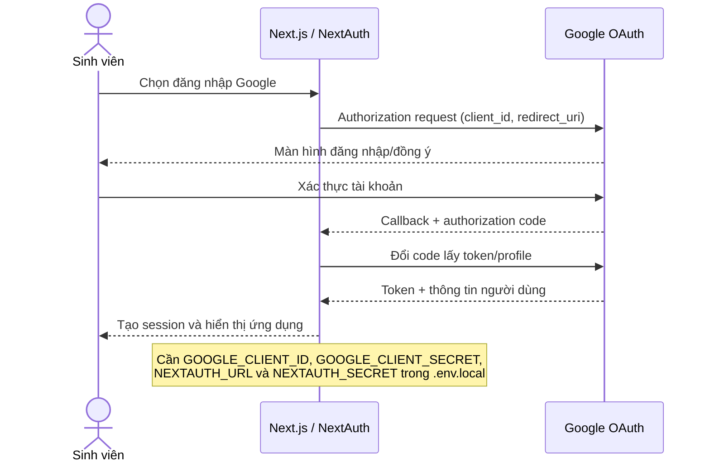
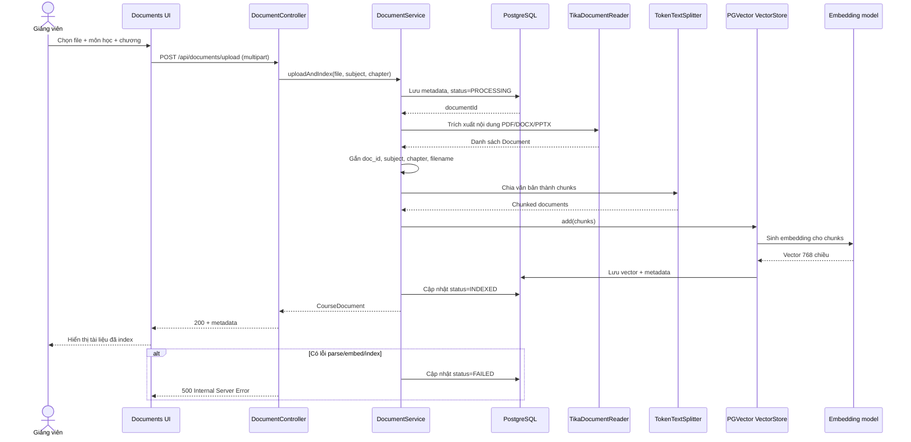
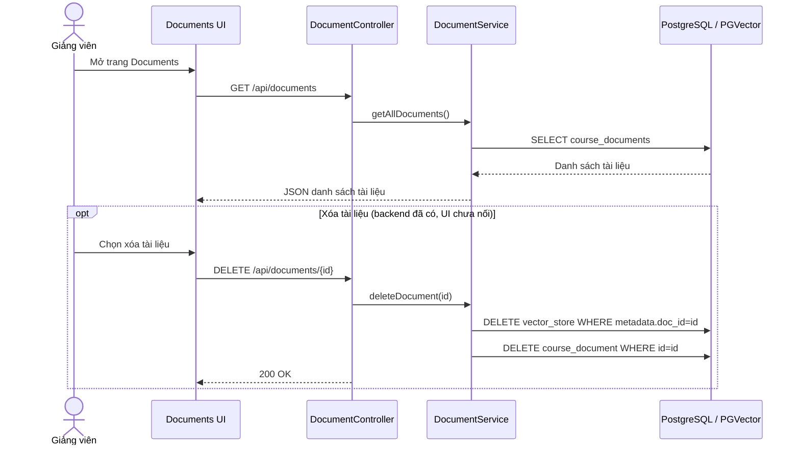
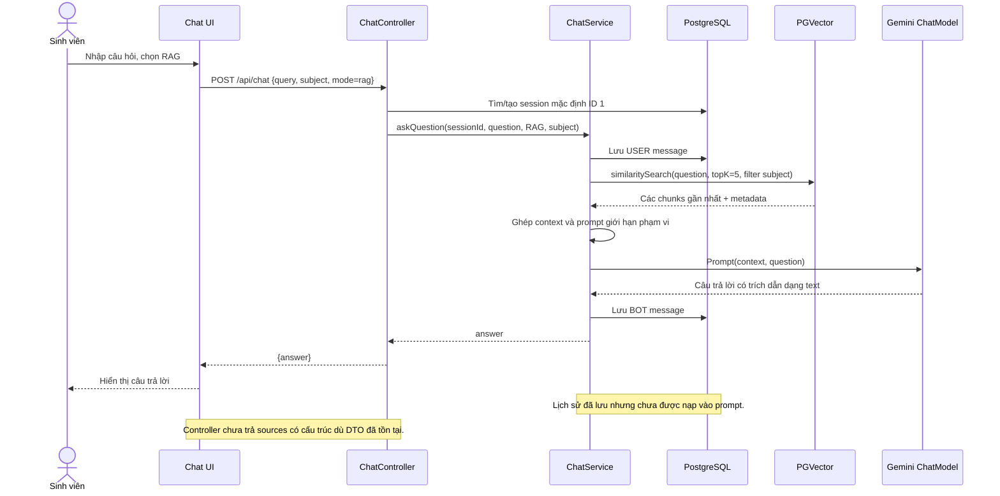
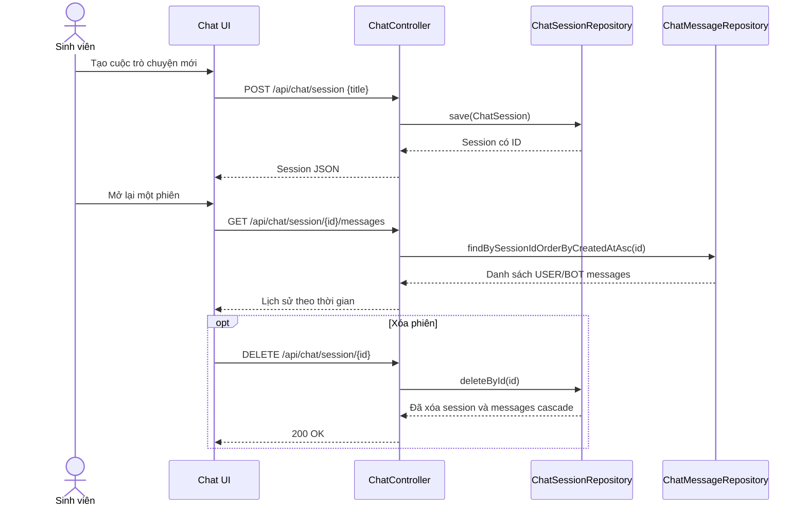
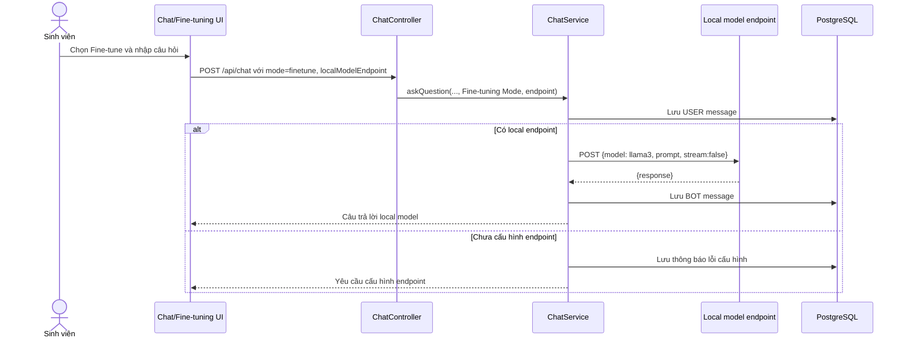
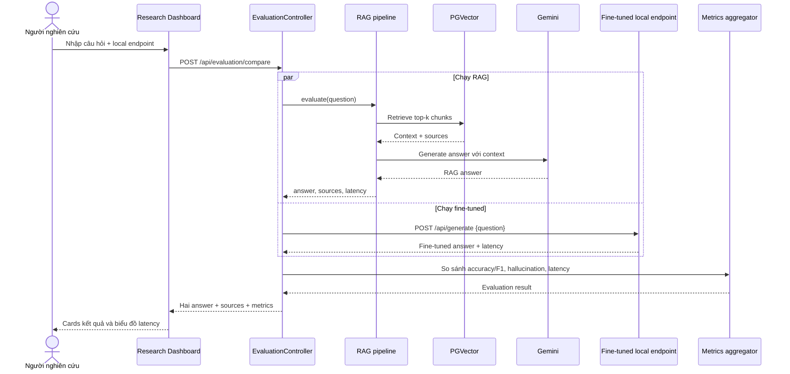
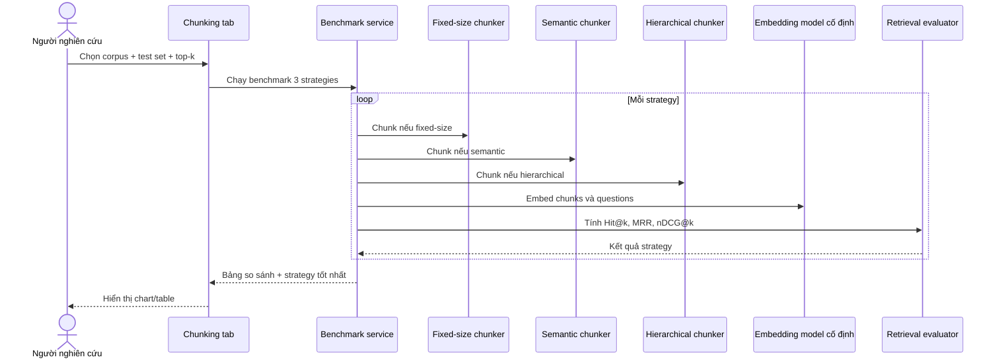
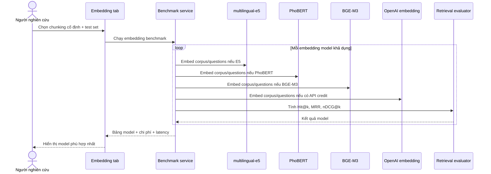

# Đối chiếu yêu cầu và sequence diagram

## Tài liệu sơ đồ

- File Draw.io chính thức: [`sequence-diagrams.drawio`](./sequence-diagrams.drawio).
- File gồm 8 trang, được trình bày theo mẫu UML sequence ShopLite: actor, participant, lifeline, activation bar, message đánh số, return nét đứt và UML frame.
- Các trang trong file:
  1. Google OAuth.
  2. Upload và index tài liệu.
  3. RAG Chat.
  4. Chat Session.
  5. Fine-tuned Chat.
  6. A/B Benchmark.
  7. Chunking Benchmark.
  8. Embedding Benchmark.
- Ba trang benchmark được gắn nhãn **Dự kiến / chưa xác minh end-to-end** nếu chức năng chưa có đầy đủ trong source Git.
- Các khối Mermaid phía dưới là bản mô tả bằng văn bản để review trên GitHub; khi xuất PNG/PDF hoặc chỉnh sửa trực quan, sử dụng file `.drawio` ở trên.

## 1. Phạm vi rà soát

- Source được rà soát: nhánh `main`, commit local `2fd06ff`.
- Remote `origin/main` đang ở `b17bc5e`, đi trước 2 commit nhưng chỉ thay đổi `README.md`, không thêm code benchmark.
- Ảnh giao diện Research Module do thành viên cung cấp được ghi nhận như bằng chứng demo. Những phần không có trong source Git được đánh dấu **demo/chưa xác minh bằng source**.

## 2. Đối chiếu yêu cầu ban đầu

| Nhóm | Yêu cầu | Trạng thái trong source Git | Bằng chứng / khoảng trống |
|---|---|---|---|
| Quản lý tài liệu | Upload PDF, DOCX, slide | Đạt một phần | UI nhận `.pdf,.docx,.pptx`; backend dùng Tika. Chưa kiểm tra MIME/extension và chưa có test parser. |
| Quản lý tài liệu | Tự động chunk và embed | Đạt một phần | `DocumentService` dùng `TokenTextSplitter` rồi `vectorStore.add`. Tuy nhiên `spring.ai.openai.embedding.enabled=false`, cần xác minh `EmbeddingModel` lúc chạy. |
| Quản lý tài liệu | Theo môn/chương | Đạt | `subject`, `chapter` được lưu vào metadata và DB. |
| Quản lý tài liệu | Danh sách tài liệu đã index | Đạt | `GET /api/documents`, trạng thái `PROCESSING/INDEXED/FAILED`. |
| Quản lý tài liệu | Xóa tài liệu | Đạt một phần | Backend có `DELETE /api/documents/{id}` và xóa vector; trang `/documents` chưa có thao tác DELETE. |
| Chat | Hỏi đáp tự nhiên | Đạt cơ bản | Có RAG chat qua Gemini và chế độ local fine-tuned. |
| Chat | Theo ngữ cảnh hội thoại | Chưa đạt | Tin nhắn được lưu nhưng lịch sử không được đưa vào prompt; trang `/chat` dùng session mặc định ID 1. |
| Chat | Trích dẫn nguồn | Đạt một phần | Prompt yêu cầu LLM tự ghi tên file. `ChatResponse`/`SourceDto` tồn tại nhưng controller chỉ trả `{answer}`, nên UI không nhận structured citations. |
| Chat | Giới hạn trong tài liệu | Đạt một phần | Có prompt từ chối ngoài phạm vi; chưa có kiểm tra retrieval rỗng/threshold độc lập và chưa có test refusal. |
| Chat | Lịch sử theo phiên | Đạt một phần | Có API tạo/xem/xóa session và lưu message. `ddl-auto=create` làm mất dữ liệu khi backend restart; frontend `/chat` chưa dùng đầy đủ API session. |
| RBL | RAG vs fine-tuned | Đạt một phần | Hai nhánh xử lý tồn tại. UI `/research` gọi `/api/evaluation/compare`, nhưng backend không có endpoint này. |
| RBL | Benchmark chunking | Chưa tích hợp | Có 3 class fixed/semantic/hierarchical nhưng không được `DocumentService` sử dụng; thiếu file `ChunkingStrategy.java` trong Git. |
| RBL | Benchmark embedding | Chưa có | Không có runner, endpoint, dataset hay bảng kết quả trong source Git hiện tại. |
| RBL | Dashboard thực nghiệm | Demo/đạt một phần | A/B UI và biểu đồ latency đã commit. Giao diện 3 tab trong ảnh chưa có trên Git và endpoint backend còn thiếu. |
| Deliverable | Web app Java + React | Có | Spring Boot + Next.js. Chưa xác minh build end-to-end vì Maven PKIX và Google Fonts network. |
| Deliverable | README trên GitHub | Có | Remote vừa cập nhật README; một số mô tả vượt quá code thực tế. |
| Deliverable | Test set 50 câu + ground truth | Chưa có trên Git | Không có thư mục/file evaluation được track. |
| Deliverable | Báo cáo thực nghiệm | Chưa có trên Git | Không có report hoặc bảng RAGAS được track. |
| Deliverable | Fine-tuned model | Có artifact | Adapter/checkpoint được commit; cần kiểm tra lại dung lượng repo và khả năng serve. |

## 3. Sequence diagram theo source thực tế

### 3.1. Đăng nhập Google OAuth

### 3.2. Upload, chunk và index tài liệu

### 3.3. Xem và xóa tài liệu

### 3.4. Hỏi đáp bằng RAG

### 3.5. Quản lý phiên và lịch sử chat

### 3.6. Hỏi đáp bằng fine-tuned model local

## 4. Sequence diagram chức năng benchmark theo ảnh

> Trạng thái: **UI A/B cơ bản đã commit; backend evaluation và giao diện 3 tab chưa có trong source Git**. Diagram dưới đây ghi nhận luồng mong muốn để thiết kế/tài liệu, không khẳng định đã triển khai end-to-end.

### 4.1. A/B Benchmark: RAG vs fine-tuned model

### 4.2. Benchmark chunking strategies

### 4.3. Benchmark embedding models

## 5. Ưu tiên cần hoàn thiện nếu tiếp tục code

1. Thêm lại `ChunkingStrategy.java` để backend có thể compile.
2. Bật/cấu hình embedding model tương thích với PGVector 768 chiều.
3. Trả `ChatResponse(answer, sources)` thay vì chỉ `{answer}`.
4. Đưa lịch sử message vào prompt và bỏ session mặc định cố định cho `/api/chat`.
5. Tạo `EvaluationController`/service cho `/api/evaluation/compare` hoặc đổi UI theo endpoint thật.
6. Kết nối 3 chunking strategy vào pipeline benchmark; bổ sung embedding runner.
7. Commit test set 50 câu, raw/summary benchmark và báo cáo thực nghiệm.
8. Thêm unit/integration tests và đổi `ddl-auto=create` sang cấu hình không xóa lịch sử khi restart.
